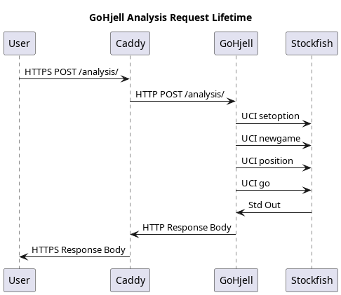
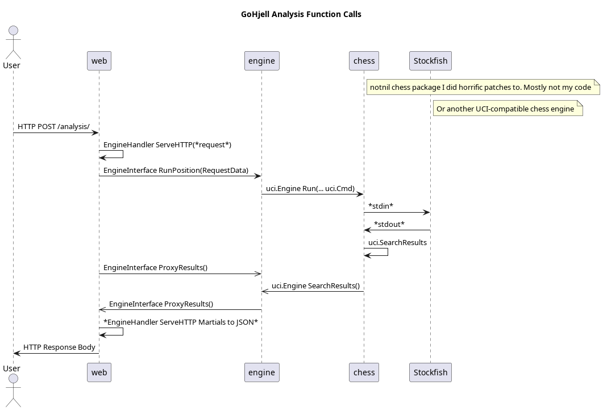

# GoHjell: A Very Specific UCI Chess Engine Wrapper
Tired of libraries that are just too configurable? Wish you could simply shoot off an HTTP request and be at the mercy of
a monstrous **_school project_**? Look no further!

## Required
The desired UCI-compatible Chess engine, over PATH OR the ability to make programmatic web requests to my hosted version.

## Getting Started
The program requires two arguments: listen address and UCI-compatible engine. 
Simply start the server and send HTTP POST requests with JSON bodies to the 
endpoint /analyze/!

Suggested Start:
`./gohjell localhost:8080 stockfish`

## Usage

A request might look like the [this](example.json).

The Forsyth-Edwards Notation must be valid non-extended format. MultiPV is configurable from 1-10 variations. Depth is configurable from 1-20.

Responses will look like [this](example-response.json).

My hosted version will require basic authentication, so don't forget to add the header with a supplied key!

## Diagrams!
*PlantUML associated with 4x increase in lifetime earnings, says local Project Manager MOOC salesman*

The first demonstrates underlying commands rather than implementation: 

The chart is more concerned with implementation: 

## Excellent Use Cases
This application is a fantastic fit for someone who might've developed a script specifically to use it. Potentially for college credit.

Others may be more interested in a [generalist chess programming library](https://github.com/notnil/chess).